# 1. 使用 virt-manager and KVM来设置Windows虚拟机

帮助您设置一个高效虚拟机以便于和 cassowary 一起使用。

这个文档是根据 `Arch Linux` 编写，所以需要根据发行版版来进行调整

### 我们首先安装 virt-manager 和 KVM

```bash
$ sudo pacman -S virt-manager
```

### 使KVM在没有root权限的情况下访问

```bash
$ sudo sed -i "s/#user = \"root\"/user = \"$(id -un)\"/g" /etc/libvirt/qemu.conf
$ sudo sed -i "s/#group = \"root\"/group = \"$(id -gn)\"/g" /etc/libvirt/qemu.conf
$ sudo usermod -a -G kvm $(id -un)
$ sudo usermod -a -G libvirt $(id -un)
$ sudo systemctl restart libvirtd
$ sudo ln -s /etc/apparmor.d/usr.sbin.libvirtd /etc/apparmor.d/disable/
```

### 启用 AppArmor 以便于网络可以访问

在某些 Linux发行版本中，如果启用了 AppArmor 则需要修改 `/etc/apparmor.d/usr.sbin.dnsmasq` 才能连接到网络，否则 virt-manager 将发生错误。

如果你找不到 `dnsmasq` 配置文件，请确保安装  AppArmor 时配置的扩展
如果你仍然找不到 `dnsmasq` 配置文件, 你需要下载 [AppArmor gitlab](https://gitlab.com/apparmor/apparmor/-/raw/master/profiles/apparmor.d/usr.sbin.dnsmasq) 并且拷贝到正确路径

```bash
$ wget https://gitlab.com/apparmor/apparmor/-/raw/master/profiles/apparmor.d/usr.sbin.dnsmasq -O ~/usr.sbin.dnsmasq
$ sudo mv ~/usr.sbin.dnsmasq /etc/apparmor.d/
```

现在，需要修改主配置文件并且在关于的末尾添加一个 `r` 

`libvirt_leaseshelper` ， 所以他会像: `/usr/libexec/libvirt_leaseshelper mr,`.

也可以通过终端命令行完成

```bash
$ sudo sed -i "s/\/usr\/libexec\/libvirt_leaseshelper m,/\/usr\/libexec\/libvirt_leaseshelper mr,/g" /etc/apparmor.d/usr.sbin.dnsmasq
```

请记住这个更改应该在每次更新 AppArmor 是重新执行。

### 建立 libvirt.conf

在某些的Linux的发行版本上，最好创建一个配置文件，以确 libvirt uri 是系统默认的版本

如果要执行此操作，请先创建文件夹  `~/.config/libvirt/` 并且在文件夹中创建 `libvirt.conf` 文件 具有 `uri_default = "qemu:///system"`

```bash
$ mkdir -p ~/.config/libvirt
$ echo "uri_default = \"qemu:///system\"" >> ~/.config/libvirt/libvirt.conf
```

现在，需要重启来生效刚才所有的修改

### 下载 Windows.iso 系统镜像和 VirtIO 的Windows驱动 

我们需要 Windows 7, 8, 或者 10 专业版, 企业版 或者 服务器版本 并且打开远程桌面RDP。
VirtIO driver will improve the VM performance while having lowest overhead.

> **请务必使用以下网站来下载系统镜像**  
> 下载连接是由 Microsoft CDN 来直接生成的

- 下载 Windows iso 镜像 : [点击连接](https://tb.rg-adguard.net/public.php)

- 下载 VirtIO iso 驱动镜像: [点击连接](https://fedorapeople.org/groups/virt/virtio-win/direct-downloads/stable-virtio/virtio-win.iso)

> 如果你使用的是Windows 7 则不需要下载VirtIO iso 因为他不支持。

并且将他们保存在方便的路径

### 创建虚拟机

>  由于我的PC是中文的，virt-manager 现实的是 ：虚拟系统管理器，所以下文软件界面中的英文我将保留

- 打开 virt-manager/虚拟系统管理器 从应用程序菜单

- 在 virt-manager/虚拟系统管理器 的菜单点击 **Edit/编辑**  -> **Preferences** ， 检查 **Enable XML editing/启用XML编辑 ** 然后关闭

  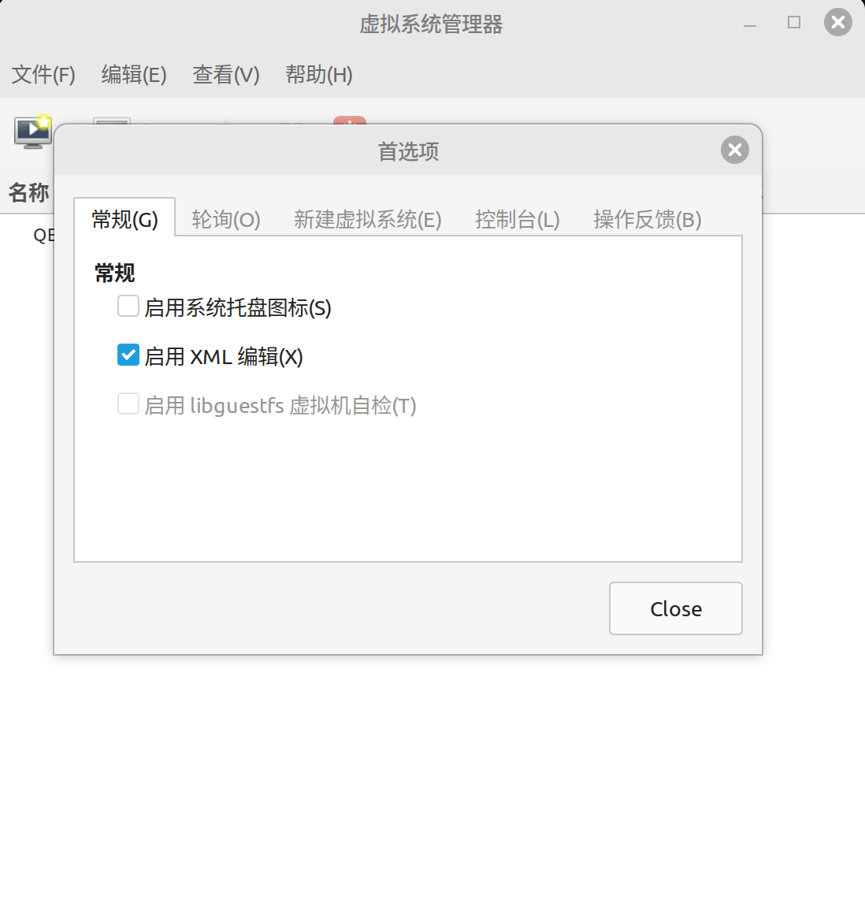

- 从 virt-manager/虚拟系统管理器 菜单中点击 **File/文件** and then **New Virtual Machine/新建虚拟机**;

- 在新建虚拟机窗口选择 **Local Install media/本地安装介质** 然后点击下一步;  

  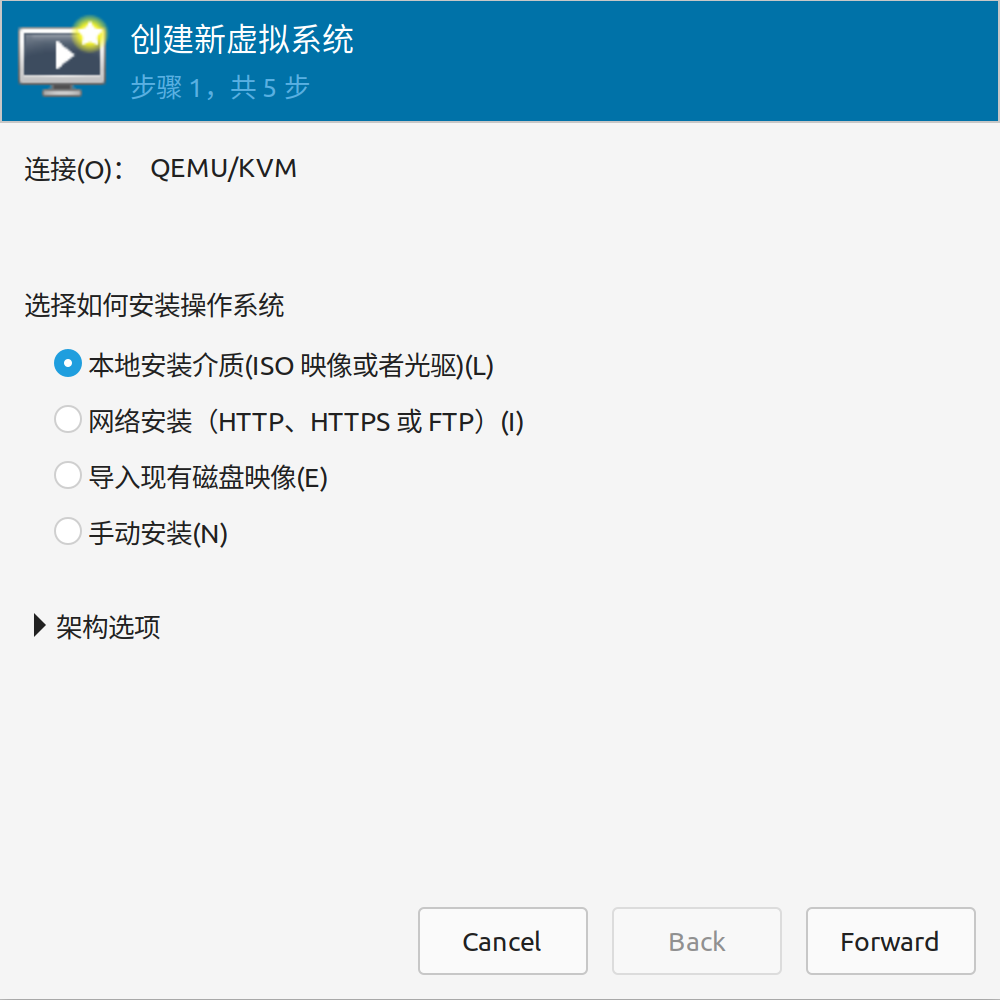

- 选择Windows.iso镜像然后点击下一步

  

- 根据您的配置设置CPU核心 、内存、磁盘空间;  

  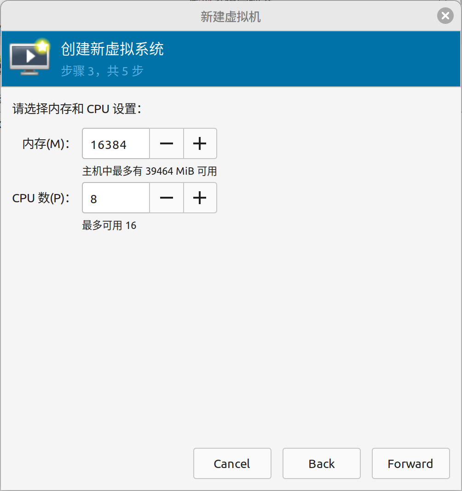

  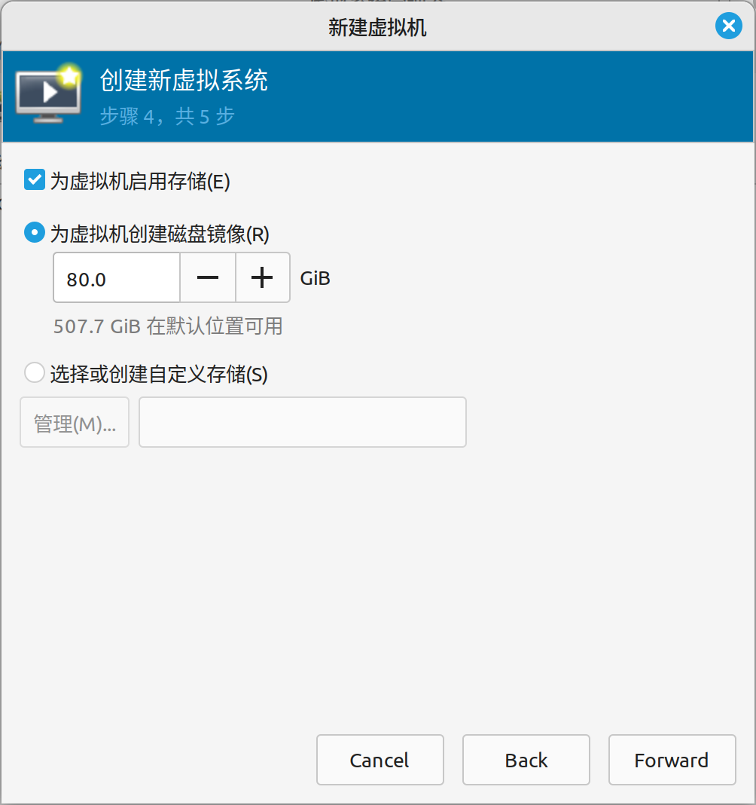

- 为虚拟机命名比如 `Win11` 并且在 **Customize configuration before install/安装前自定义配置** 然后点击完成！  

  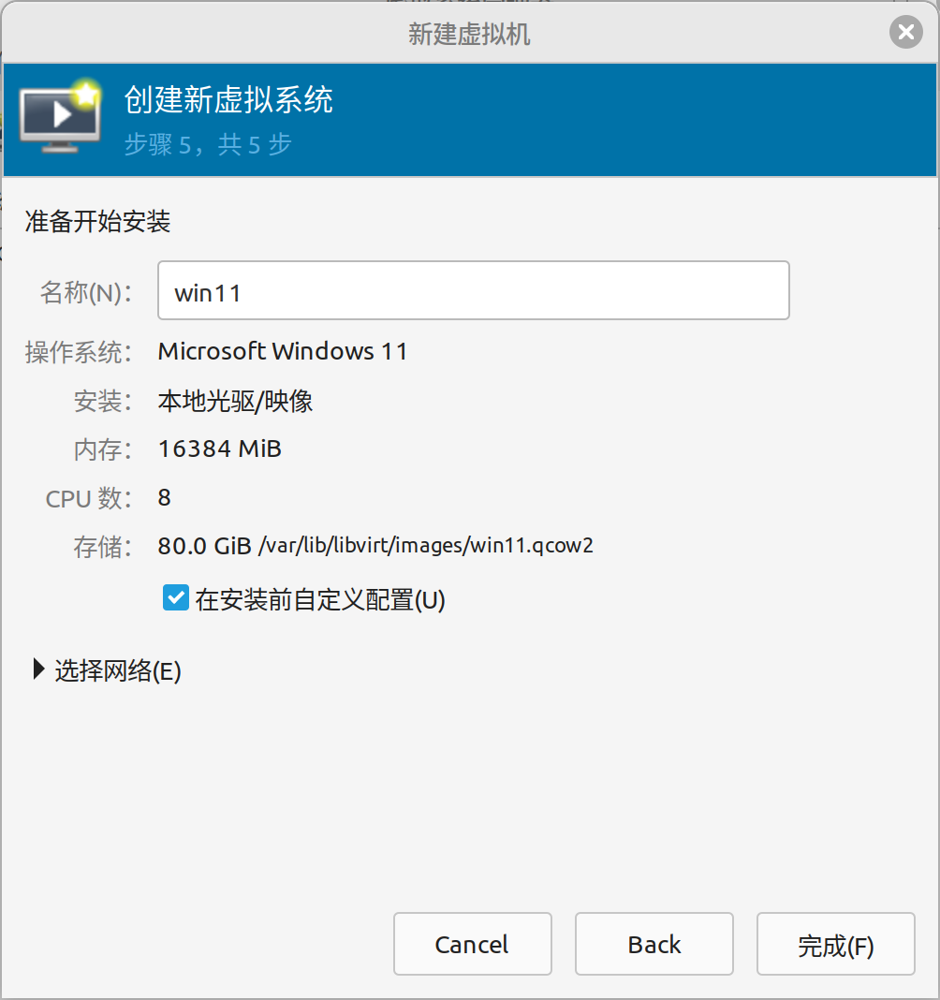

- 在CPU选项中确保 **Copy host configuration/复制主机CPU配置** ：  

  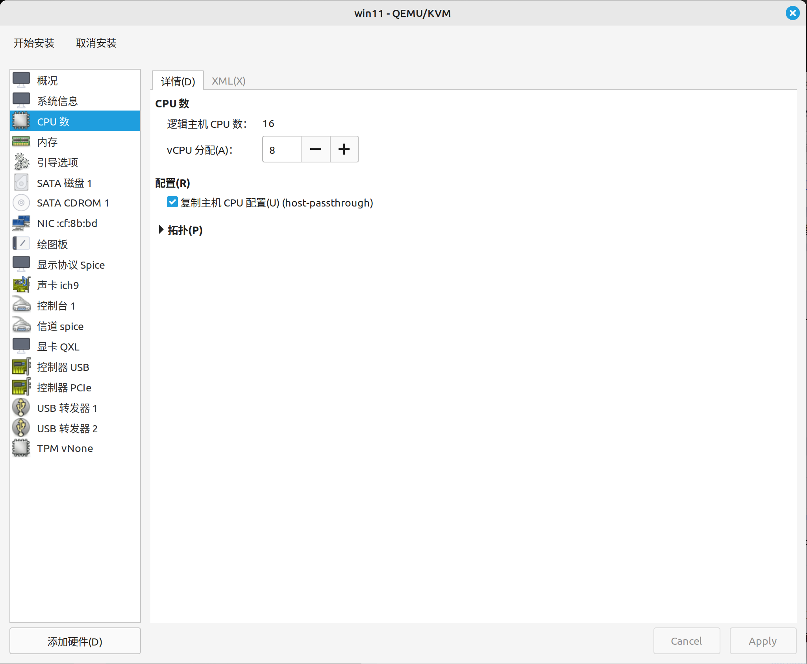

- 跳转到CPU选项的XML选项卡找到并修改以下内容

```xml
<clock offset="localtime">
    .......
    .......
</clock>
```

修改:

```xml
<clock offset="localtime">
  <timer name="hpet" present="yes"/>
  <timer name="hypervclock" present="yes"/>
</clock>
```

- 在虚拟机选项卡中 **Current allocation/当前分配** 设置为 **1024**，因此虚拟机不会直接使用全部内存，而是从当前分配到最大分配

  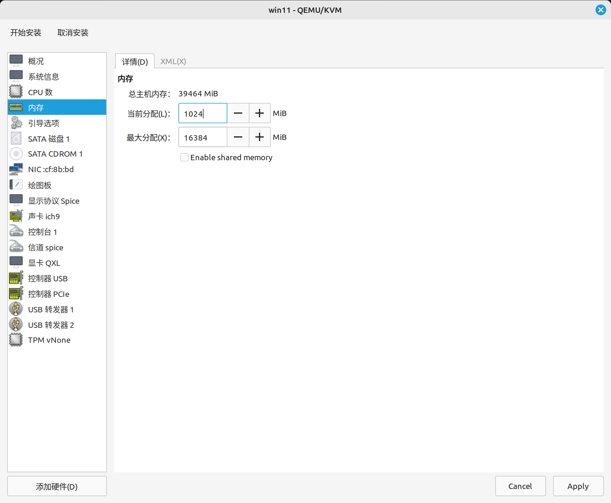

- 在 “Boot Options/引导选项” 选项卡中，如果您希望在系统启动时启动虚拟机则需要勾选 **Start the virtual machine on host bootup/主机引导时启动虚拟机** 

- 在 “SATA Disk 1/SATA 磁盘 1“ 选项卡中 **Disk bus/硬盘总线** 选择 **VirtIO**;  

> 如果您使用的是Windows 7，请跳过此步骤，因为不支持VirtIO。

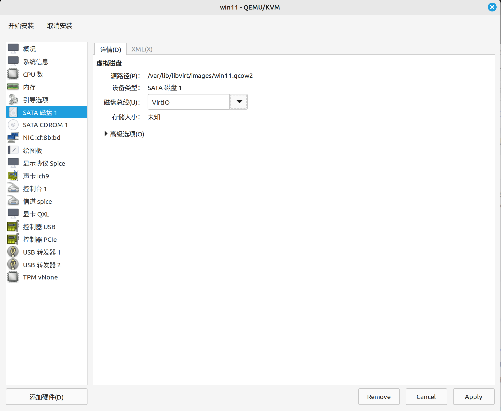

- 移到 NIC 选项卡将 **Device model/设备型号** 设置为 **virtio**;  

  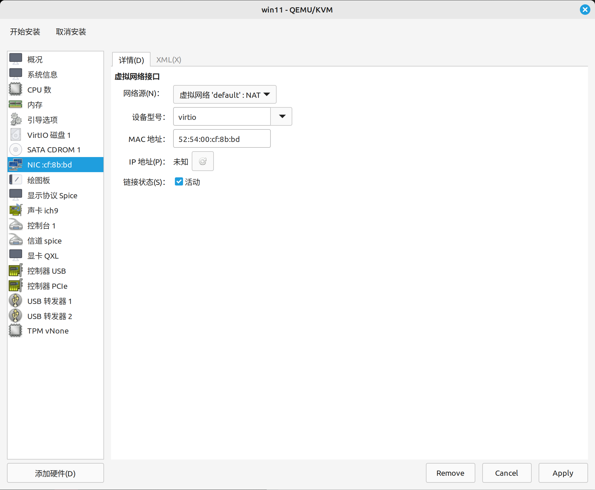

- 点击左下角的 **Add hardware/添加硬件** 选择 **Storage/存储** 然后选择 **Select or Create custom storage/选择或创建自定义存储**； 点击 **Manage/管理**，浏览并设置下载的`virtio-win` 驱动ISO。然后将设备设置为 **CDROM** 点击完成;  

  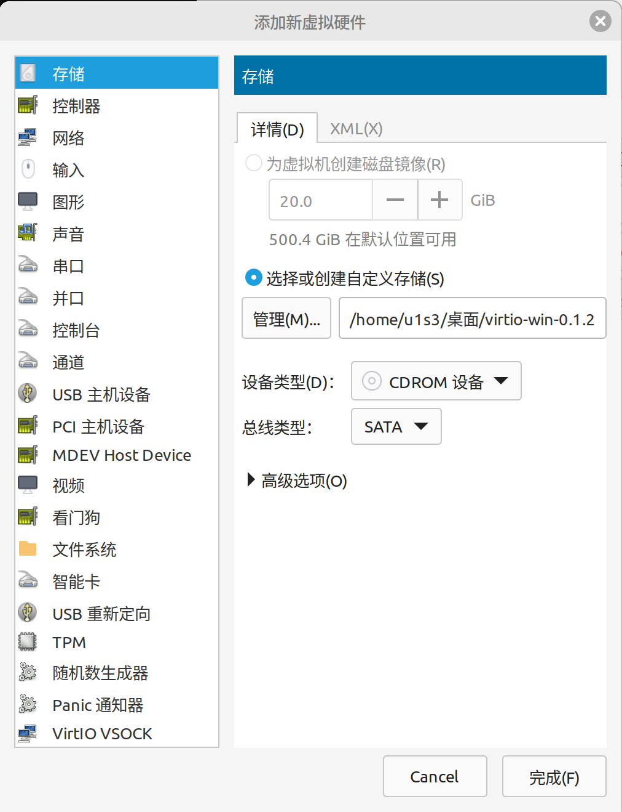

- 点击左上角 **Begin Installation/开始安装** ；

- 按照Windows的安装说明进行操作，当选择自定义安装时，将无法安装 Windows 。要使 VirtIO 启动正常工作，必须单击 **Load Driver/加载驱动程序**，然后点击 **OK/确定** 最后选择Windows的驱动程序

  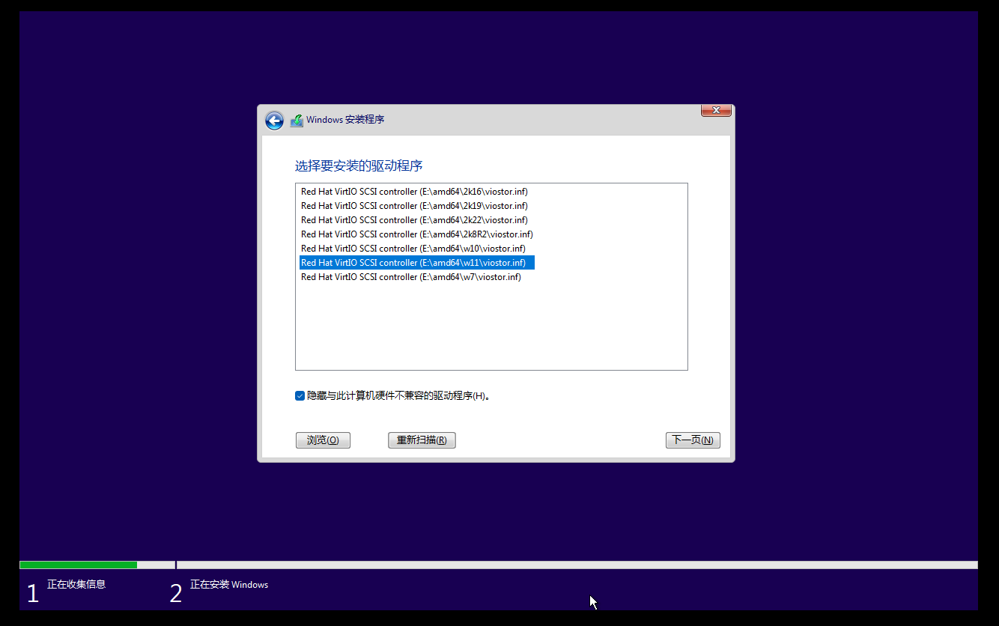

> 如果没有加载或显示驱动程序，请让Windows在VirtIO磁盘的“amd64/win11”文件夹中搜索它们。当您的操作系统是win10或其他版本就选择win10或其他文件夹

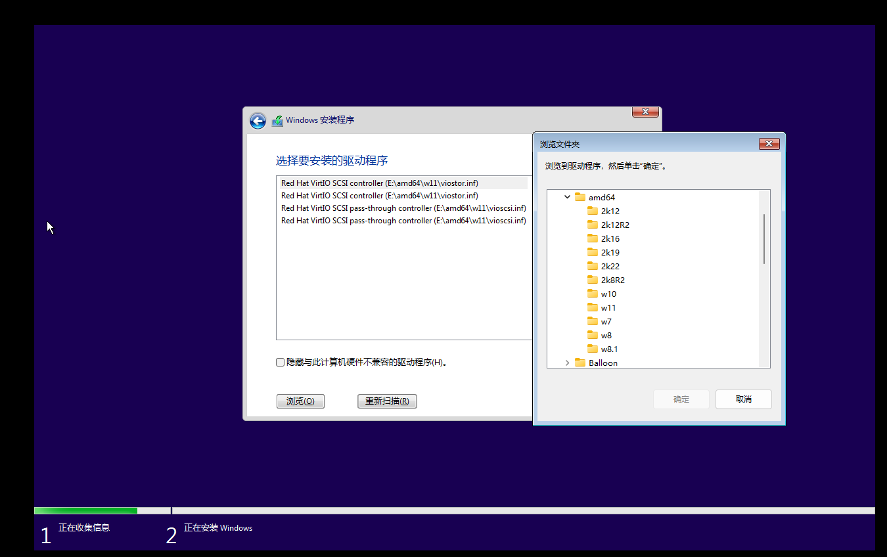


- 之后，你的驱动器将显示，你可以像正常的Windows 安装一样继续；

- 一段时间后，您将进入“让我们连接到互联网页面”，单击左下角的 **我没有互联网**，继续进行有限的设置；

  >如果win11无法选择 **“我没有互联网”** ，则可以按快捷键 `shitf + F10` 打开命令提示符 输入`start explorer.exe` 选择加载的 `VirtIO` 驱动光驱进行驱动安装

- 设置您的用户名和密码。密码不允许为空；

  > 小技巧：win11安装时邮箱输入`1@a.cn` 可以跳过微软帐号使用本地用户登陆。

- 进入Windows 10桌面后，打开这台电脑，浏览到virtio-win CD驱动器，安装**virtio-win-gt-x64.exe**；

- 建议安装 [spice guest tools](https://www.spice-space.org/download/windows/spice-guest-tools/spice-guest-tools-latest.exe) 可以在主机和客户机之间进行复制粘贴；

- 关闭虚拟机，从菜单栏中选择**查看**，然后选择**详细信息**；

- 转到 “Display Spice /显示协议“  **Listen Type/监听** 选择 **None**；并且选中 OpenGL 保存

- 点击 “Video QXL/显示卡QXL“ 把 **Model/型号** 设置为 **VirtIO** 并且勾选**“3D加速”**

> 如果在这些更改后出现黑屏，请恢复这些更改。nvidia显卡可能会出现这种情况；

- 单击左上角的播放按钮启动虚拟机（您可能需要单击监视器图标以显示虚拟机屏幕）。登录到桌面；
- 打开浏览器并浏览此页面，然后继续安装 `cassowary` 

---

注意：为了获得更好的3D性能，您可以使用VMware或其他虚拟化平台，（IP自动检测和VM自动挂起目前仅适用于基于libvirt的平台。

---

**下一步** -> [在Windows虚拟机和Linux主机中安装cassowary](2-cassowary-install.md)
